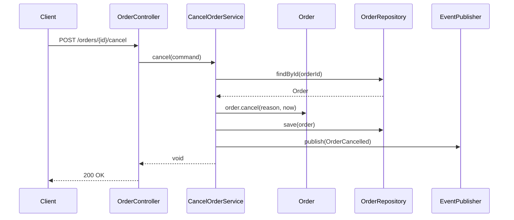
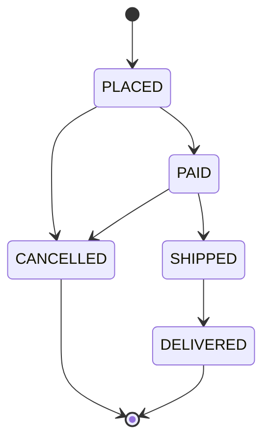

# Documentation - 문서화 가이드

이 스킬은 **코드가 완성된 후, 커밋 직전** 단계에서 사용합니다.
문서는 코드 변경과 **같은 PR** 에 반드시 포함되어야 합니다.

---

## 1. 문서화 범위 (체크리스트)

기능 구현 후 아래 항목을 점검합니다. 해당 없음은 skip, 해당 있음은 반드시 업데이트.

- [ ] **JavaDoc**: public API (Controller, Application Service, Domain Aggregate Root) 메서드
- [ ] **README.md**: 새 모듈/디렉토리 추가 시 또는 실행 방법 변경 시
- [ ] **OpenAPI (Swagger)**: Controller 가 추가/변경되면 갱신
- [ ] **ADR**: 아키텍처적 결정이 있을 때 (새 라이브러리 도입, 패턴 변경 등)
- [ ] **아키텍처 다이어그램** (`docs/architecture/`): 새 Bounded Context 또는 주요 통신 경로 변경 시
- [ ] **CHANGELOG.md**: 사용자 영향 있는 변경 (API 변경, 동작 변경)
- [ ] **마이그레이션 가이드**: Breaking Change 가 있을 때

---

## 2. JavaDoc 작성 기준

### 2.1 대원칙

**"무엇을 하는가" 가 아닌 "왜 / 어떻게 써야 하는가" 를 쓴다.**

- 메서드 이름이 명확하면 "무엇" 은 생략한다.
- 사용자(호출자) 관점에서 필요한 정보만 쓴다.
- 계약(contract)을 명시한다: 입력 제약, 출력 보장, 던지는 예외.

### 2.2 대상 선별

**반드시 JavaDoc 을 쓰는 곳**:
- Public API Controller 메서드
- Application Service public 메서드
- Domain Aggregate Root의 상태 변경 메서드 (`cancel()`, `approve()` 등)
- 복잡한 도메인 규칙을 가진 Value Object
- 재사용되는 Utility / Helper

**JavaDoc 을 쓰지 않아도 되는 곳**:
- private 메서드 (이름이 명확하면)
- getter / setter
- 자명한 DTO 필드
- 테스트 코드

### 2.3 템플릿

```java
/**
 * 주문을 취소합니다. 이미 배송된 주문은 취소할 수 없습니다.
 *
 * <p>취소 성공 시 {@link OrderCancelled} 도메인 이벤트가 발행되며,
 * 환불 처리는 결제 모듈에서 이벤트를 수신하여 비동기로 수행됩니다.
 *
 * @param reason 취소 사유 (null 불가). 코드 목록은 {@link CancellationReason} 참조.
 * @param now    취소 시각. 테스트에서 주입 가능하도록 외부에서 전달받습니다.
 * @throws OrderCannotBeCancelledException 주문이 이미 배송/배달 상태인 경우
 * @throws OrderAlreadyCancelledException  주문이 이미 취소된 상태인 경우
 */
public void cancel(CancellationReason reason, Instant now) { ... }
```

### 2.4 태그 사용 규칙

| 태그 | 용도 | 필수 여부 |
|---|---|---|
| `@param` | 각 파라미터의 제약과 의미 | 파라미터 있으면 필수 |
| `@return` | 반환값의 의미, 특수값(null, empty) | 반환값 있으면 필수 |
| `@throws` | 던지는 예외와 조건 | 명시적으로 던지면 필수 |
| `@see` | 관련 클래스/메서드 | 선택 |
| `@since` | 도입된 버전 | 공개 라이브러리에만 |
| `@deprecated` | 대체 메서드 안내 | deprecate 시 필수 |

### 2.5 안티 패턴

```java
// ❌ 나쁜 예: 메서드명 그대로 반복
/**
 * Cancel order.
 * @param reason the reason
 */
public void cancel(String reason) { ... }

// ❌ 나쁜 예: 구현 세부사항 노출
/**
 * HashMap 을 사용해 O(1) 로 조회합니다.
 */
public Optional<Order> findById(OrderId id) { ... }

// ✅ 좋은 예: 계약 중심
/**
 * 주어진 ID 의 주문을 조회합니다.
 *
 * <p>존재하지 않는 ID 에 대해서는 빈 {@link Optional} 을 반환하며,
 * 예외를 던지지 않습니다.
 *
 * @param id 조회할 주문 ID (null 불가)
 * @return 주문이 존재하면 해당 객체를 감싼 Optional, 없으면 {@link Optional#empty()}
 */
public Optional<Order> findById(OrderId id) { ... }
```

---

## 3. README.md 업데이트

### 3.1 루트 README 구조 (권장)

```markdown
# <프로젝트명>

<한 줄 소개>

## 📋 목차
- [시작하기](#시작하기)
- [아키텍처](#아키텍처)
- [개발 가이드](#개발-가이드)
- [API 문서](#api-문서)

## 🚀 시작하기

### 사전 요구사항
- Java 21
- Docker (Testcontainers 용)
- MySQL 8 (로컬 또는 Docker)

### 실행
```bash
./gradlew bootRun
```

### 테스트
```bash
./gradlew test
```

## 🏗 아키텍처

- DDD 기반 Layered Architecture
- 상세: [docs/architecture/README.md](docs/architecture/README.md)
- 결정 기록: [docs/adr/](docs/adr/)

## 📘 개발 가이드

- [CLAUDE.md](CLAUDE.md) — Claude Code 작업 가이드
- [.claude/skills/](.claude/skills/) — 단계별 스킬
- 코딩 컨벤션: Google Java Style Guide

## 📡 API 문서

- 로컬: http://localhost:8080/swagger-ui.html
- 스펙 파일: [docs/openapi.yaml](docs/openapi.yaml)
```

### 3.2 업데이트 트리거

아래 중 하나라도 해당되면 README 를 갱신합니다.

- 빌드 / 실행 명령 변경
- 환경 변수 추가
- 외부 의존성 추가 (Redis, Kafka 등)
- 새로운 Bounded Context 추가
- 기본 포트, 프로파일 변경

---

## 4. ADR (Architecture Decision Record)

### 4.1 언제 작성하는가?

**다음의 경우 반드시 ADR 을 남깁니다**:
- 새로운 라이브러리/프레임워크 도입 (예: QueryDSL, Kafka)
- 기존 패턴 변경 (예: 동기 → 비동기)
- 아키텍처 경계 이동 (예: 모듈 분리)
- 영속성 전략 변경 (예: JPA → MyBatis 또는 Event Sourcing)
- 보안/인증 방식 변경

### 4.2 위치와 네이밍

```
docs/adr/
├── 0001-use-ddd-layered-architecture.md
├── 0002-separate-domain-from-jpa-entity.md
├── 0003-adopt-testcontainers-for-integration-test.md
└── ...
```

파일명: `<4자리 순번>-<kebab-case-제목>.md`

### 4.3 템플릿

```markdown
# ADR-0004: 주문 취소 이벤트 처리를 비동기로 변경

- **Status**: Accepted
- **Date**: 2026-04-20
- **Deciders**: @user1, @user2

## Context

주문 취소 시 결제 환불, 재고 복원, 알림 발송이 트랜잭션 안에서 순차 실행되고 있었다.
이로 인해:
1. 외부 결제사 API 지연이 전체 트랜잭션을 블로킹
2. 알림 실패가 취소 자체를 롤백시키는 부작용
3. 평균 응답 시간이 2초를 초과

## Decision

`OrderCancelled` 이벤트를 Spring `ApplicationEventPublisher` 로 발행하고,
`@TransactionalEventListener(phase = AFTER_COMMIT)` 로 후처리한다.

외부 호출(결제, 알림)은 **트랜잭션 커밋 이후** 별도 스레드에서 실행하며,
실패 시 재시도 큐(Outbox 패턴)에 적재한다.

## Consequences

**긍정**
- 주문 취소 응답 시간이 200ms 이내로 개선
- 외부 시스템 장애가 주문 취소에 영향을 주지 않음

**부정**
- 최종 일관성(eventual consistency)을 허용해야 함
- Outbox 테이블과 리트라이 스케줄러 추가 구현 필요
- 운영 모니터링 대상 증가

## Alternatives Considered

1. **메시지 큐(Kafka) 도입**: 운영 비용 부담으로 현재 단계에서 과설계.
2. **현 상태 유지**: 응답 지연 SLA 위반이 지속되어 기각.

## References

- Fowler, "Outbox Pattern"
- 관련 이슈: #142
```

### 4.4 ADR 원칙

- **기각된 ADR 도 남긴다** (Status: Rejected / Superseded).
- 수정이 아닌 **추가** 로 변화를 기록 (ADR-0007 supersedes ADR-0004).
- 한 ADR = 한 결정. 여러 결정 섞지 않는다.

---

## 5. OpenAPI / Swagger 문서

### 5.1 자동 생성 + 보완

`springdoc-openapi` 사용 시 어노테이션으로 문서를 보강한다.

```java
@Operation(
    summary = "주문 취소",
    description = "이미 배송된 주문은 취소할 수 없습니다. 취소 성공 시 환불 이벤트가 발행됩니다."
)
@ApiResponses({
    @ApiResponse(responseCode = "200", description = "취소 성공"),
    @ApiResponse(responseCode = "400", description = "이미 배송된 주문",
        content = @Content(schema = @Schema(implementation = ErrorResponse.class))),
    @ApiResponse(responseCode = "404", description = "주문 없음"),
    @ApiResponse(responseCode = "409", description = "이미 취소된 주문")
})
@PostMapping("/{orderId}/cancel")
public CancelOrderResponse cancel(...) { ... }
```

### 5.2 DTO 문서

```java
public record CancelOrderRequest(
    @Schema(description = "취소 사유 코드", example = "CUSTOMER_REQUEST",
            allowableValues = {"CUSTOMER_REQUEST", "OUT_OF_STOCK", "SYSTEM_ERROR"})
    @NotBlank String reason,

    @Schema(description = "상세 사유 (선택)", example = "사이즈 변경")
    String detail
) {}
```

### 5.3 스펙 파일 커밋

`/v3/api-docs` 의 결과를 빌드 시 `docs/openapi.yaml` 로 저장해 PR 에 포함한다.
이렇게 하면 **API 변경이 diff 로 드러난다**.

```bash
./gradlew generateOpenApiDocs  # springdoc-openapi-gradle-plugin 제공
```

---

## 6. 아키텍처 다이어그램

### 6.1 권장 표기법

- **Context/Container 다이어그램**: C4 Model (structurizr 또는 draw.io)
- **시퀀스 다이어그램**: Mermaid (Git 에서 바로 렌더링됨)
- **상태 전이**: Mermaid state diagram

### 6.2 Mermaid 예시 (README 내 삽입)

````markdown

````

### 6.3 상태 전이 예시

````markdown

````

---

## 7. CHANGELOG.md

Keep a Changelog 형식을 따릅니다 (https://keepachangelog.com).

```markdown
# Changelog

## [Unreleased]

### Added
- 주문 취소 API (`POST /orders/{id}/cancel`)
- `OrderCancelled` 도메인 이벤트

### Changed
- 주문 상태 `CANCELLED` 추가에 따른 상태 전이 로직 업데이트

### Fixed
- (없음)

### Breaking
- (없음)

## [1.2.0] - 2026-04-10
...
```

**원칙**:
- 사용자/클라이언트가 체감할 변경만 기재 (내부 리팩토링은 제외).
- Breaking Change 는 별도 섹션으로 강조.
- Git tag 와 버전이 일치해야 함.

---

## 8. 문서화 자가 검증 체크리스트

커밋 직전 아래를 확인합니다.

- [ ] 새로 추가한 public API 에 JavaDoc 이 있는가?
- [ ] JavaDoc 이 "무엇" 이 아닌 "왜 / 계약" 을 설명하는가?
- [ ] README 의 실행/설정 관련 부분이 현재 코드와 일치하는가?
- [ ] API 변경이 있었다면 OpenAPI 스펙이 갱신되었는가?
- [ ] 아키텍처 결정이 있었다면 ADR 을 추가했는가?
- [ ] CHANGELOG 의 Unreleased 섹션에 반영했는가?
- [ ] 외부 문서 (Confluence 등) 와 모순되지 않는가?
- [ ] 다이어그램에 변경이 필요한가? (Bounded Context 추가 등)

---

## 9. 다음 단계

문서 갱신이 완료되면:
- 커밋 → `.claude/skills/commit-convention/SKILL.md`
- 문서 변경은 관련 코드와 **같은 커밋** 또는 **같은 PR** 에 포함할 것.
