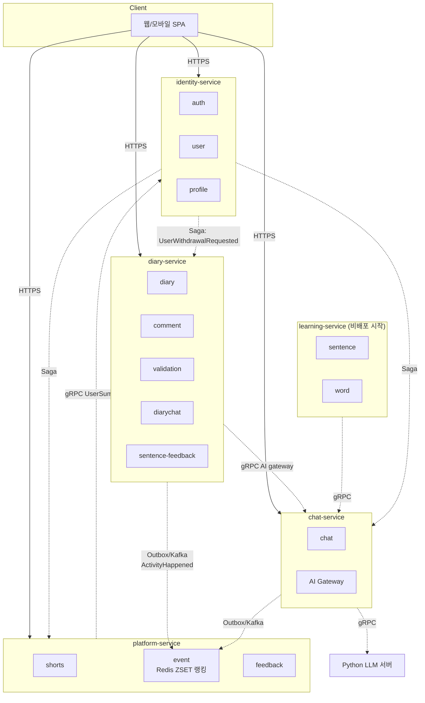

# jamo-backend

> AI 피드백 기반 일기·학습·소통 플랫폼의 그린필드 백엔드. **DDD + MSA 멀티모듈** 로 처음부터 설계.

[](https://openjdk.org/projects/jdk/21/)
[](https://spring.io/projects/spring-boot)
[](LICENSE)

---

## At a Glance

| 항목 | 내용 |
|---|---|
| **기술 스택** | Java 21 · Spring Boot 3.5 · Gradle (Kotlin DSL) · MySQL · Redis · Kafka · gRPC |
| **아키텍처** | DDD (Layered) + MSA 멀티모듈 (모노레포) |
| **서비스 수** | **5** (identity, diary, chat, learning, platform) |
| **공유 모듈** | `:contracts` (proto + 이벤트), `:common-auth-jwt`, `:common-infrastructure` |
| **PRD 도메인** | **13** / **API 약 60+** |
| **인증** | OAuth2 (KAKAO/NAVER/GOOGLE) + LOCAL + JWT(RS256) + PKCE + Refresh Rotation |
| **AI 통합** | chat-service 가 Python LLM 서버에 gRPC 호출, 다른 서비스는 chat-service 의 AI gateway 만 호출 |
| **MSA 패턴** | Saga(Choreography) · Outbox · Read Model 동기화(Redis ZSET) · Circuit Breaker · Token Relay |

---

## 왜 jamo?

기존 모놀리식 코드를 **참고하지 않고**, PRD(요구사항 명세) 만 추출해서 처음부터 다시 짓는 그린필드 프로젝트입니다. 1인 개발 + 학습/포트폴리오 목적으로:

- **DDD 원칙을 타협 없이 적용** — 도메인 객체와 JPA Entity 를 분리, 의존성 방향을 안쪽으로 강제
- **MSA 패턴을 실전 흐름 안에서 등장시킴** — Saga(회원 탈퇴), Outbox(모든 도메인 이벤트), Read Model(랭킹 ZSET), gRPC(AI gateway) 가 책에 갇히지 않고 우리 코드에 등장
- **모든 의사결정을 ADR 로 기록** — 왜 이 옵션을 골랐는지, 어떤 트레이드오프가 있는지가 코드와 함께 산다
- **Claude Code 기반 워크플로우 표준화** — 계획 → 설계 검증 → 구현 → 테스트 → 리뷰(병렬) → 문서 → 커밋 → PR 단계가 [`.claude/skills/`](.claude/skills/) 와 [`.claude/agents/`](.claude/agents/) 로 명문화

---

## 아키텍처 한눈에



5개 서비스 ↔ 13개 도메인 매핑, 의존 그래프 자세히 → [`docs/architecture/service-domain-mapping.md`](docs/architecture/service-domain-mapping.md)

---

## 핵심 의사결정 (ADR)

설계의 "왜" 가 궁금하면 ADR 부터 읽으면 됩니다. 각 ADR 은 검토한 옵션 / 트레이드오프 / 결정 / 영향 / 후속 결정 항목을 모두 기록합니다.

| # | 제목 | 한 줄 요약 |
|---|---|---|
| [ADR-0001](docs/adr/0001-authentication-architecture.md) | 인증 아키텍처 | 별도 `auth-service` + 게이트웨이 없음 + 각 서비스 JWT 직접 검증. PKCE + Refresh Rotation + Redis 블랙리스트로 디바이스별 즉시 무효화. |
| [ADR-0002](docs/adr/0002-service-decomposition.md) | 서비스 분할 | 13 도메인 → **5 서비스** (identity / diary / chat / learning / platform). AI 호출은 chat-service 단일 진입점. |

> 후속 ADR (ADR-0003~ ArchUnit, contracts 표준, AI gateway proto, 회원 탈퇴 Saga 상세, 활동 점수 가중치 등) 은 트리거 시점마다 추가됩니다.

---

## 도메인 PRD

PRD 는 도메인별로 정리되어 있고, 진행 상태는 [`docs/prd/_status.md`](docs/prd/_status.md) 에서 한 번에 추적할 수 있습니다.

| 도메인 묶음 | 담당 서비스 | PRD |
|---|---|---|
| auth · user · profile | identity-service | [`docs/prd/{auth,user,profile}/`](docs/prd/) |
| diary · comment · validation · diarychat · sentence-feedback | diary-service | [`docs/prd/diary/`](docs/prd/diary/), [`docs/prd/comment/`](docs/prd/comment/), [`docs/prd/validation/`](docs/prd/validation/), [`docs/prd/diarychat/`](docs/prd/diarychat/) |
| chat | chat-service | [`docs/prd/chat/`](docs/prd/chat/) |
| sentence · word | learning-service | [`docs/prd/sentence/`](docs/prd/sentence/), [`docs/prd/word/`](docs/prd/word/) |
| shorts · event · feedback | platform-service | [`docs/prd/shorts/`](docs/prd/shorts/), [`docs/prd/event/`](docs/prd/event/), [`docs/prd/feedback/`](docs/prd/feedback/) |

**대표 PRD 한 가지** — 일기 작성 중 AI 가 50자 문장 단위로 더 나은 표현을 제안하고, 사용자가 수락/거부하는 흐름을 라이프사이클 상태머신(REQUESTED → SUGGESTED → ACCEPTED/REJECTED/EXPIRED/FAILED)으로 모델링한 사례:
- [`requestSentenceFeedback.md`](docs/prd/diary/requestSentenceFeedback.md)
- [`acceptSentenceFeedback.md`](docs/prd/diary/acceptSentenceFeedback.md)
- [`rejectSentenceFeedback.md`](docs/prd/diary/rejectSentenceFeedback.md)

---

## MSA 패턴이 실제로 어디서 등장하는가

| 패턴 | 등장 위치 |
|---|---|
| **Saga (Choreography)** | 회원 탈퇴 — identity → diary/chat/learning/platform 4 서비스 데이터 삭제 → identity 최종 삭제 |
| **Outbox** | 모든 도메인 이벤트 발행 (DiaryCreated, CommentCreated, ChatGenerated, ActivityHappened, SentenceFeedbackRequested ...) |
| **멱등성 (ProcessedEvent)** | 모든 Kafka Consumer (활동 이벤트 구독, Saga 회신 구독 등) |
| **Read Model 동기화** | platform-service 의 사용자 활동 점수 → **Redis Sorted Set(ZSET)** 글로벌 랭킹 (ZINCRBY / ZREVRANGE) |
| **gRPC** | chat-service 가 `AiAssistantService` 노출, diary/learning/platform 이 호출. chat-service 가 Python LLM 서버에 호출 |
| **Circuit Breaker / Deadline / Retry** | 모든 gRPC 클라이언트 호출 (Resilience4j) |
| **Token Relay** | gRPC metadata `authorization: Bearer <accessJWT>` 그대로 전파 |

자세한 패턴 설명 → [`.claude/skills/module-boundary/SKILL.md`](.claude/skills/module-boundary/SKILL.md)

---

## 개발 워크플로우

모든 작업은 다음 단계를 따릅니다 (자세한 규칙은 [`CLAUDE.md`](CLAUDE.md) 참조):

```
[요구사항] → [계획] → [설계 검증] → [구현] → [테스트] → [리뷰(병렬)] → [문서] → [커밋] → [PR]
                ↑          ↑          ↑         ↑              ↑               ↑           ↑          ↑
       code-planning  ddd-architect  ddd-     testing-    code-reviewer +  documentation commit-   pr-
                                    architecture  junit   test-reviewer +                  convention guidelines
                                                          security-reviewer
```

각 단계 가이드는 [`.claude/skills/`](.claude/skills/) 에, 독립 컨텍스트로 검증하는 리뷰어는 [`.claude/agents/`](.claude/agents/) 에.

---

## 빌드 & 실행 (현재 상태)

> 현재는 **그린필드 부트스트랩 단계** — Spring Initializr 기본 골격만 존재합니다. 멀티모듈 분할 + 첫 use case 구현은 후속 PR 에서 진행됩니다.

```bash
./gradlew clean build
./gradlew bootRun
```

실제 도메인 흐름은 ADR-0001/0002 결정에 따라 단계별로 추가됩니다 — 시작은 identity-service 의 OAuth 흐름 use case PR 부터.

---

## 저장소 구조

```
jamo/
├── CLAUDE.md                      # Claude Code 작업 규칙 (jamo 전용)
├── README.md                      # 본 파일
├── LICENSE                        # MIT
├── build.gradle.kts               # 루트 빌드 (멀티모듈 분할 예정)
├── settings.gradle.kts
├── src/                           # 임시 골격 (멀티모듈 후 각 서비스 모듈로 분산)
├── docs/
│   ├── adr/                       # Architecture Decision Records
│   ├── architecture/              # 매핑/카탈로그 등 보조 문서
│   └── prd/                       # 도메인별 PRD (요구사항 명세)
└── .claude/
    ├── skills/                    # 단계별 작성 가이드
    ├── agents/                    # 독립 컨텍스트 리뷰어 (code, test, security, ddd-architect)
    └── prompts/                   # 단계 진행용 프롬프트
```

---

## 후속 작업 로드맵 (요약)

| Phase | 내용 |
|---|---|
| **0** | 멀티모듈 골격 (5 서비스 + contracts + common 모듈) + ArchUnit + ADR-0003/0004 |
| **1** | identity-service: OAuth 시작/콜백/토큰 교환 use case |
| **2** | identity-service: 토큰 회전/로그아웃 |
| **3** | identity-service: LOCAL 가입 + 이메일 검증 |
| **4** | diary-service: 일기 작성/조회/피드 |
| **5** | chat-service 골격 + Python LLM gRPC 클라이언트 |
| **6** | diary-service: sentence-feedback (PRD 3개 구현) |
| **7+** | diarychat / chat 나머지 / platform-service 활동·랭킹 / 회원 탈퇴 Saga |

---

## License

[MIT](LICENSE) © 2026 rivkode
