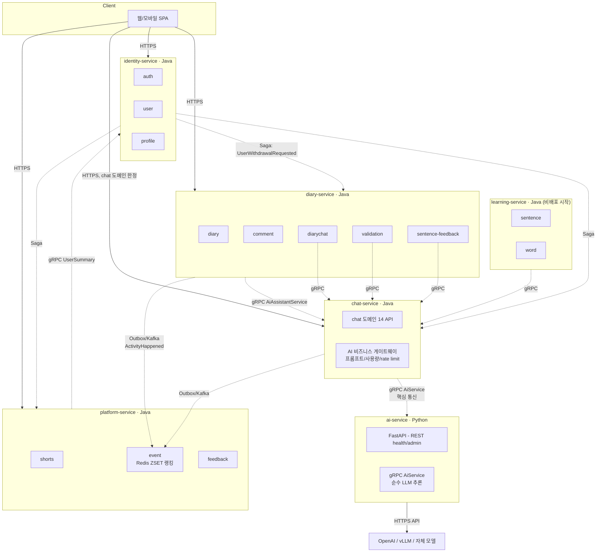

# jamo-backend

> AI 피드백 기반 일기·학습·소통 플랫폼의 그린필드 백엔드. **Java DDD MSA + Python LLM 게이트웨이** 를 처음부터 설계.

[](https://openjdk.org/projects/jdk/21/)
[](https://spring.io/projects/spring-boot)
[](https://www.python.org/)
[](LICENSE)

---

## At a Glance

| 항목 | 내용 |
|---|---|
| **기술 스택** | Java 21 · Spring Boot 3.5 · Gradle (Kotlin DSL) · MySQL · Redis · Kafka · gRPC · Python 3.12 (FastAPI + grpcio) |
| **아키텍처** | DDD (Layered) + MSA 멀티모듈 (모노레포). **Java 5 서비스 + Python 1 서비스** |
| **서비스 수** | **6** — Java 5 (identity, diary, chat, learning, platform) + Python 1 (ai-service) |
| **공유 모듈** | `:contracts` (proto + 이벤트, **Java + Python 양쪽 빌드 입력**), `:common-auth-jwt`, `:common-infrastructure` |
| **PRD 도메인** | **13** / **API 약 60+** |
| **인증** | OAuth2 (KAKAO/NAVER/GOOGLE) + LOCAL + JWT(RS256) + PKCE + Refresh Rotation |
| **AI 통합** | **chat-service (Java)** = 비즈니스 게이트웨이 (프롬프트/사용량/rate limit). **ai-service (Python)** = 순수 LLM 추론. 두 서비스가 **gRPC 로 긴밀 통신**. |
| **MSA 패턴** | Saga(Choreography) · Outbox · Read Model 동기화(Redis ZSET) · Circuit Breaker · Token Relay · 두 언어 gRPC |

---

## 왜 jamo?

기존 모놀리식 코드를 **참고하지 않고**, PRD(요구사항 명세) 만 추출해서 처음부터 다시 짓는 그린필드 프로젝트입니다. 1인 개발 + 학습/포트폴리오 목적으로:

- **DDD 원칙을 타협 없이 적용** — 도메인 객체와 JPA Entity 를 분리, 의존성 방향을 안쪽으로 강제
- **MSA 패턴을 실전 흐름 안에서 등장시킴** — Saga(회원 탈퇴), Outbox(모든 도메인 이벤트), Read Model(랭킹 ZSET), gRPC(AI 호출) 가 책에 갇히지 않고 우리 코드에 등장
- **Java + Python 두 언어 monorepo** — chat-service(Java) ↔ ai-service(Python) 의 gRPC 통신을 통해 양 언어 생태계의 강점을 모두 활용 (Spring 의 비즈니스 로직 / DDD + Python 의 LLM 생태계 LangChain/vLLM)
- **모든 의사결정을 ADR 로 기록** — 왜 이 옵션을 골랐는지, 어떤 트레이드오프가 있는지가 코드와 함께 산다
- **Claude Code 기반 워크플로우 표준화** — 계획 → 설계 검증 → 구현 → 테스트 → 리뷰(병렬) → 문서 → 커밋 → PR 단계가 [`.claude/skills/`](.claude/skills/) 와 [`.claude/agents/`](.claude/agents/) 로 명문화

---

## 아키텍처 한눈에



### AI 호출의 두 단계 분리 (ADR-0003)

```
[다른 Java 서비스] ──gRPC AiAssistantService──▶ [chat-service Java]
                                                       │ - 프롬프트 / 사용량 / rate limit
                                                       │ - chat 도메인 비즈니스
                                                       │
                                                       │ gRPC AiService.complete
                                                       ▼
                                                [ai-service Python]
                                                       │ - 순수 LLM 추론 호출
                                                       │ - OpenAI / vLLM / 자체
                                                       ▼
                                                [LLM 모델]
```

서비스 ↔ 도메인 매핑, 의존 그래프 자세히 → [`docs/architecture/service-domain-mapping.md`](docs/architecture/service-domain-mapping.md)

---

## 핵심 의사결정 (ADR)

설계의 "왜" 가 궁금하면 ADR 부터 읽으면 됩니다. 각 ADR 은 검토한 옵션 / 트레이드오프 / 결정 / 영향 / 후속 결정 항목을 모두 기록합니다.

| # | 제목 | 한 줄 요약 |
|---|---|---|
| [ADR-0001](docs/adr/0001-authentication-architecture.md) | 인증 아키텍처 | 별도 `auth-service` + 게이트웨이 없음 + 각 서비스 JWT 직접 검증. PKCE + Refresh Rotation + Redis 블랙리스트로 디바이스별 즉시 무효화. |
| [ADR-0002](docs/adr/0002-service-decomposition.md) | 서비스 분할 | 13 도메인 → **5 Java 서비스** (identity / diary / chat / learning / platform). 회원 탈퇴는 Choreography Saga, 활동 랭킹은 Redis ZSET Read Model. ADR-0003 보강으로 ai-service 추가. |
| [ADR-0003](docs/adr/0003-ai-call-architecture.md) | AI 호출 분리 | **chat-service (Java)** = 비즈니스 게이트웨이 / **ai-service (Python)** = 순수 LLM/STT/TTS 추론. 두 서비스 사이는 gRPC 긴밀 통신. Python AI 생태계(LangChain, vLLM, Whisper) 활용. |
| [ADR-0004](docs/adr/0004-contracts-naming-and-versioning.md) | contracts 명명/버전/빌드 표준 | proto 파일/서비스/메시지/Kafka 이벤트의 명명 규칙, field number 변경 금지 + Breaking Change 시 V2 버전 클래스, Java/Python 양쪽 빌드 동기화 (Makefile 권고). |

> 후속 ADR (ArchUnit 강화, AI gateway proto 인터페이스 설계, 회원 탈퇴 Saga 상세, 활동 점수 가중치 등) 은 트리거 시점마다 추가됩니다.

---

## 도메인 PRD

PRD 는 도메인별로 정리되어 있고, 진행 상태는 [`docs/prd/_status.md`](docs/prd/_status.md) 에서 한 번에 추적할 수 있습니다.

| 도메인 묶음 | 담당 서비스 | PRD |
|---|---|---|
| auth · user · profile | identity-service | [`docs/prd/{auth,user,profile}/`](docs/prd/) |
| diary · comment · validation · diarychat · sentence-feedback | diary-service | [`docs/prd/diary/`](docs/prd/diary/), [`docs/prd/comment/`](docs/prd/comment/), [`docs/prd/validation/`](docs/prd/validation/), [`docs/prd/diarychat/`](docs/prd/diarychat/) |
| chat | chat-service (Java) — AI 호출은 ai-service(gRPC) 위임 | [`docs/prd/chat/`](docs/prd/chat/) |
| sentence · word | learning-service | [`docs/prd/sentence/`](docs/prd/sentence/), [`docs/prd/word/`](docs/prd/word/) |
| shorts · event · feedback | platform-service | [`docs/prd/shorts/`](docs/prd/shorts/), [`docs/prd/event/`](docs/prd/event/), [`docs/prd/feedback/`](docs/prd/feedback/) |
| (LLM 추론) | **ai-service (Python)** — proto 만, REST/HTTP API 없음 | (PRD 없음, ADR-0003 참조) |

**대표 PRD 한 가지** — 일기 작성 중 AI 가 50자 문장 단위로 더 나은 표현을 제안하고, 사용자가 수락/거부하는 흐름을 라이프사이클 상태머신(REQUESTED → SUGGESTED → ACCEPTED/REJECTED/EXPIRED/FAILED)으로 모델링한 사례. 호출 흐름은 SPA → diary-service → chat-service(gRPC) → ai-service(gRPC) → LLM:
- [`requestSentenceFeedback.md`](docs/prd/diary/requestSentenceFeedback.md)
- [`acceptSentenceFeedback.md`](docs/prd/diary/acceptSentenceFeedback.md)
- [`rejectSentenceFeedback.md`](docs/prd/diary/rejectSentenceFeedback.md)

---

## MSA 패턴이 실제로 어디서 등장하는가

| 패턴 | 등장 위치 |
|---|---|
| **Saga (Choreography)** | 회원 탈퇴 — identity → diary/chat/learning/platform 4 Java 서비스 데이터 삭제 → identity 최종 삭제. ai-service 는 무상태라 참여 X |
| **Outbox** | 모든 도메인 이벤트 발행 (DiaryCreated, CommentCreated, ChatGenerated, ActivityHappened, SentenceFeedbackRequested ...) |
| **멱등성 (ProcessedEvent)** | 모든 Kafka Consumer (활동 이벤트 구독, Saga 회신 구독 등) |
| **Read Model 동기화** | platform-service 의 사용자 활동 점수 → **Redis Sorted Set(ZSET)** 글로벌 랭킹 (ZINCRBY / ZREVRANGE) |
| **gRPC (Java↔Java)** | chat-service `AiAssistantService` 노출, diary/learning/platform 이 호출. identity-service `UserSummaryService` |
| **gRPC (Java↔Python)** ⭐ | **chat-service → ai-service `AiService.complete`** — gRPC 도입의 핵심 가치 (ADR-0003) |
| **Circuit Breaker / Deadline / Retry** | 모든 gRPC 클라이언트 호출 (Resilience4j). chat→llm 은 Deadline 30s + Retry 1회 |
| **Token Relay** | gRPC metadata `authorization: Bearer <accessJWT>` 그대로 전파 |

자세한 패턴 설명 → [`.claude/skills/module-boundary/SKILL.md`](.claude/skills/module-boundary/SKILL.md)

---

## 개발 워크플로우

모든 작업은 다음 단계를 따릅니다 (자세한 규칙은 [`CLAUDE.md`](CLAUDE.md) 참조):

```
[요구사항] → [계획] → [설계 검증] → [구현] → [테스트] → [리뷰(병렬)] → [문서] → [커밋] → [PR]
                ↑          ↑          ↑         ↑              ↑               ↑           ↑          ↑
       code-planning  ddd-architect  ddd-     testing-    code-reviewer +  documentation commit-   pr-
                                    architecture  junit   test-reviewer +                  convention guidelines
                                                          security-reviewer
```

각 단계 가이드는 [`.claude/skills/`](.claude/skills/) 에, 독립 컨텍스트로 검증하는 리뷰어는 [`.claude/agents/`](.claude/agents/) 에.

---

## 빌드 & 실행 (현재 상태)

> **Phase 0 (멀티모듈 골격) 완료.** 8 Gradle 모듈 + 1 Python 서비스 구조 등록. 실제 도메인 use case 는 Phase 1+ (identity-service OAuth) 에서 시작.

### Java 측 (8 모듈)

```bash
./gradlew clean build              # 전체
./gradlew :identity-service:build  # 단일 서비스
./gradlew :identity-service:bootRun
```

각 서비스 별도 bootRun. 8 모듈: `:contracts`, `:common-auth-jwt`, `:common-infrastructure`, `:identity-service`, `:diary-service`, `:chat-service`, `:learning-service`, `:platform-service`.

### Python ai-service (`python-services/ai-service/`)

```bash
cd python-services/ai-service
uv sync                           # 의존성 동기화
uv run python main.py             # FastAPI (REST: health/admin) — :8086
uv run python grpc_server.py      # gRPC AiService 서버 — :9090 (placeholder)
```

자세한 내용은 [`python-services/ai-service/README.md`](python-services/ai-service/README.md).

### proto 빌드 (contracts 변경 시)

```bash
# Java
./gradlew :contracts:generateProto

# Python (contracts/*.proto → python-services/ai-service/proto/*_pb2.py)
cd python-services/ai-service
uv run python -m grpc_tools.protoc \
    --proto_path=../../contracts/src/main/proto \
    --python_out=proto --grpc_python_out=proto \
    ../../contracts/src/main/proto/ai.proto
```

자동화 (Makefile) 는 [ADR-0004 §7](docs/adr/0004-contracts-naming-and-versioning.md) 권고대로 Phase 1 시점에 추가.

실제 도메인 흐름은 ADR-0001/0002/0003 결정에 따라 단계별로 추가됩니다 — 시작은 identity-service 의 OAuth 흐름 use case PR 부터.

---

## 저장소 구조

```
jamo-backend/                          # monorepo 루트
├── CLAUDE.md                          # Claude Code 작업 규칙 (jamo 전용)
├── README.md                          # 본 파일
├── LICENSE                            # MIT
├── build.gradle.kts                   # 루트 빌드 (멀티모듈 분할 예정)
├── settings.gradle.kts
├── src/                               # 임시 골격 (멀티모듈 후 각 서비스 모듈로 분산)
├── docs/
│   ├── adr/                           # Architecture Decision Records
│   ├── architecture/                  # 매핑/카탈로그 등 보조 문서
│   └── prd/                           # 도메인별 PRD (요구사항 명세)
├── python-services/                   # Python 서비스 묶음 (Gradle 외부)
│   └── ai-service/                   # FastAPI + grpcio (AiService — ADR-0003)
└── .claude/
    ├── skills/                        # 단계별 작성 가이드
    ├── agents/                        # 독립 컨텍스트 리뷰어 (code, test, security, ddd-architect)
    └── prompts/                       # 단계 진행용 프롬프트
```

---

## 후속 작업 로드맵 (요약)

| Phase | 내용 | 상태 |
|---|---|:---:|
| **0** | 멀티모듈 골격 (5 Java 서비스 + contracts + 2 common 모듈 + `python-services/ai-service/`) + ArchUnit 골격 + ADR-0004 (contracts 표준) | ✅ 완료 (PR #4~#7) |
| **1** | identity-service: OAuth 시작/콜백/토큰 교환 use case + Makefile (proto 빌드 자동화) | ▶ 다음 |
| **2** | identity-service: 토큰 회전/로그아웃 | |
| **3** | identity-service: LOCAL 가입 + 이메일 검증 | |
| **4** | diary-service: 일기 작성/조회/피드 | |
| **5** | **chat-service (Java) + ai-service (Python) 실 구현 + gRPC `AiService.Complete` 시연** (proto 작성 + AiServiceServicer + OpenAI 클라이언트) — **ADR-0005 (gRPC 인터페이스 설계) 함께** | |
| **6** | diary-service: sentence-feedback (PRD 3개 구현) — chat-service → ai-service 호출 흐름 검증 | |
| **7+** | diarychat / chat 도메인 나머지 / platform-service 활동·랭킹 / 회원 탈퇴 Saga | |

---

## License

[MIT](LICENSE) © 2026 rivkode
